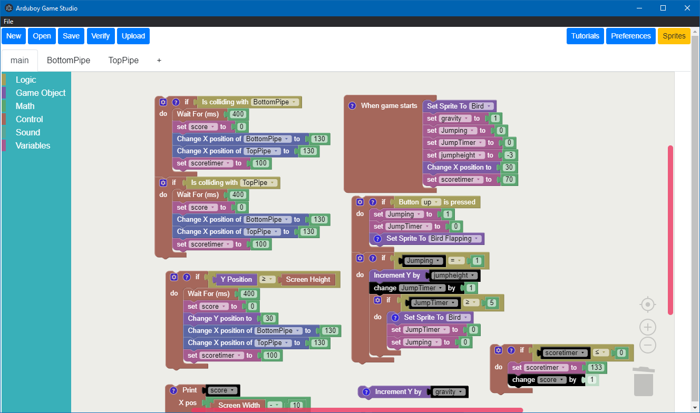

# Arduboy Game Studio



Arduboy Game Studio was developed as part of the group project module for my Computer Science degree. It was developed together with Thomas Homsy (thomashomsy@sky.com) and Dallas Frankel (dallasfrankel@outlook.com).

## Features
- Block-based visual programming
- Arduboy compatability layer in C++
- Integrated, custom Sprite Creator
- Multi-tab workspace
- Project persistence
- C++ code generation
- Compile & Upload directly to a connected Arduboy

## First time setup
```
# Setup windows build tools
npm install -g windows-build-tools
#  Install libraries
npm install
# Rebuild electron libraries
npm run rebuild
# Start the app
npm start
# Close App
#Rebuild
npm run rebuild
# Start the app again
npm start
```
